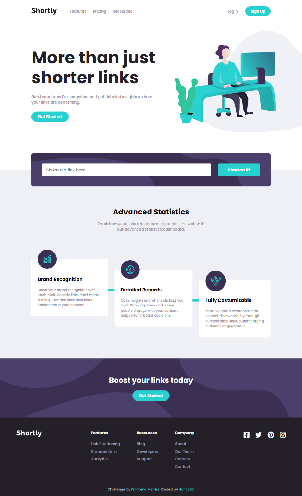
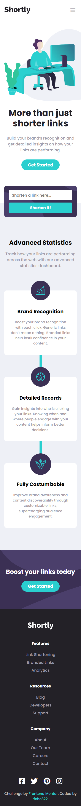

# Frontend Mentor - Shortly URL shortening API solution

This is a solution to the [Shortly URL shortening API Challenge challenge on Frontend Mentor](https://www.frontendmentor.io/challenges/url-shortening-api-landing-page-2ce3ob-G).

## Table of contents

- [Overview](#overview)
  - [The challenge](#the-challenge)
  - [Screenshot](#screenshot)
  - [Links](#links)
- [My process](#my-process)
  - [Built with](#built-with)
  - [What I learned](#what-i-learned)
  - [Useful resources](#useful-resources)
- [Author](#author)

## Overview

### The challenge

Users should be able to:

- &#9989; View the optimal layout for the site depending on their device's screen size
- &#9989; Shorten any valid URL
- &#9989; See a list of their shortened links, even after refreshing the browser
- &#9989; Copy the shortened link to their clipboard in a single click
- &#9989; Receive an error message when the `form` is submitted if:
  The `input` field is empty

### Screenshot

<p align="center">
  <strong>Desktop</strong>
</p>
<p align="center">
  
</p>
<p align="center">
  <strong>Mobile</strong>
</p>
<p align="center">
  
</p>

### Links

- Frontend Mentor solution URL: [Shortly URL shortening API Solution](https://www.frontendmentor.io/solutions/shortly-url-shortening-api-solution-using-scss-bem-flex-and-grid-brURUP6bZh)
- Live Site URL: [Shortly URL shortening API Live Website](https://rfcho322.github.io/fem-shortly/)

## My process

### Built with

- Semantic HTML5 markup
- SCSS
- Flexbox
- Grid
- JavaScript
- Mobile-first workflow


### What I learned

So I had trouble implementing a pipeline like connector to each of my card with features even though I know how to implement it, the pipeline is overlapping with the card. What seems to be the problem is that even though I have a background color set to my card, I also have to apply a background color to the title and description so that the pipeline is behind it.

Here is how I implemented a responsive pipeline like connector for my card features, so for mobile it's vertical and for desktop it's horizontal.

```css
.features__item:not(:last-child):after {
  content: "";
  width: 10px;
  height: 200px;
  background-color: hsl(180, 66%, 49%);
  position: absolute;
  z-index: -1;
  left: 50%;
  transform: translateX(-50%);
}
@media (min-width: 64em) {
  .features__item:not(:last-child):after {
    width: 100%;
    height: 10px;
    top: 50%;
    left: 65%;
    transform: translateY(50%);
  }
}
```

### Useful resources

- [Clipboard API](https://developer.mozilla.org/en-US/docs/Web/API/Navigator/clipboard) - I use Clipboard API to implement copy features within my my web application.
- [shrtcode API](https://shrtco.de/docs) - I use shrtcode API to shorten link.

## Author

- Frontend Mentor - [@rfcho322](https://www.frontendmentor.io/profile/rfcho322)
- CodePen - [@rfcho322](https://codepen.io/rfcho322)
